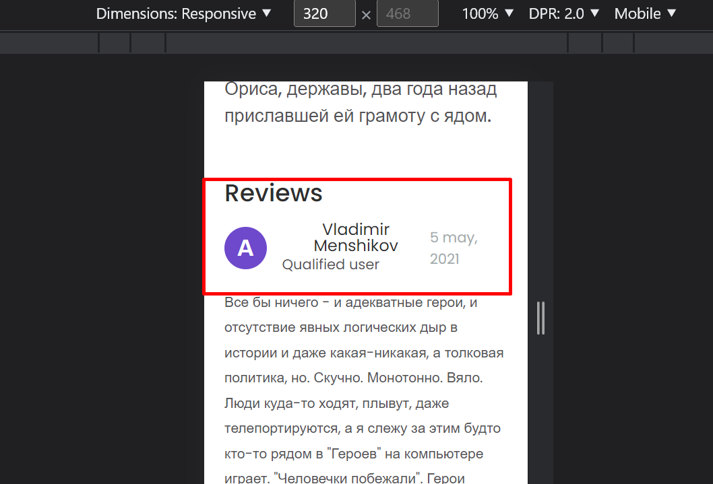
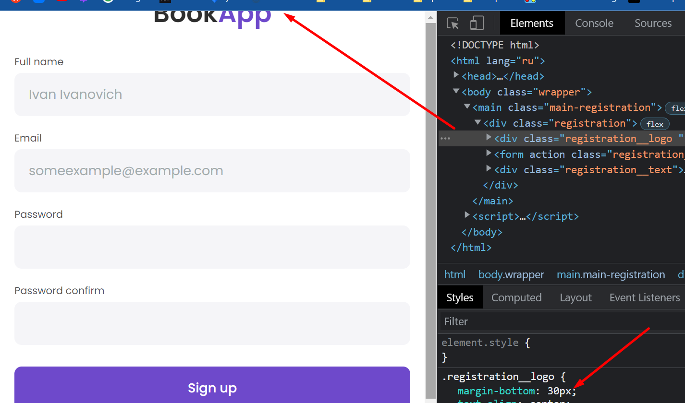

1. Сайт выглядит хорошо, вёрстка работает как надо, молодец! Есть пара недочетов, о них ниже будет написано.
2. С форматированием кода проблемы по всему проекту. Очень советую чекнуть хоткеи для своей IDE. Там есть возможность
   авто форматирования кода, она существенно упростит жизнь. А вообще, мой личный совет - покопайся в своей IDE,
   посмотри видео. гарантирую, найдешь много полезного. IDE главный инструмент разработчика, надо его хорошо знать)
3. По поводу классов. Не стесняйся выносить в отдельные классы свойства которые переиспользуются многократно. Я описал
   подробнее в _book.scss чем меньше копипасты тем лучше, но и упарываться тоже не стоит. Всё как в обычном
   программировании.
4. **_Довольно много ошибок повторяются по всему проекту, поэтому я не стал их всех помечать. Например, форматирование,
   вынос каких-то свойств в переменную, жду что ты пофиксишь во всех местах._**
5. 
6. 
